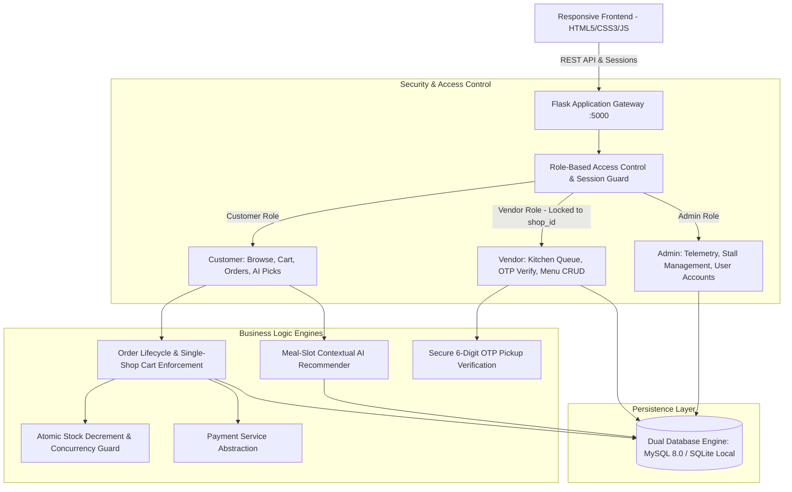

# AI-Powered Pre-Ordered App for College Food Court

[](https://python.org)
[](https://flask.palletsprojects.com/)
[](https://mysql.com)
[]()

An institutional, AI-powered pre-ordering, inventory-managed, and OTP-authenticated digital food court management system built for **KPR Institute of Engineering and Technology (KPRIET)**.

---

## 1. System Architecture



---

## 2. Core Functional Modules

### A. Customer Experience (Student, Faculty & Guest)
* **Multi-Persona Authentication**:
  * **Students**: Institutional `@kpriet.ac.in` domain verification with Roll Number tracking.
  * **Faculty**: Staff ID validation with institutional credentials.
  * **Guests**: Mobile/email registration with OTP verification.
* **One Cart = One Shop**: Strict enforcement preventing mixed-stall orders. Customers are prompted to clear their cart before switching stalls.
* **Shop-Scoped AI Food Recommender**: AI recommendations are strictly bound to the stall currently selected, incorporating time-of-day meal slots (Breakfast, Lunch, Evening Snacks, Dinner), sales velocity, and prior taste affinity.
* **Real-time Order Bill & OTP Token**: Assigned 6-digit pickup OTP and reference ID upon checkout.

### B. Vendor Operations (KPRIET Food Court Stalls)
* **Tenant Isolation**: Vendors are cryptographically and sessionally locked to their assigned stall (`shop_id`). Cross-stall data leakage (IDOR) is strictly blocked (HTTP 403 Forbidden).
* **Live Kitchen Display Queue**: Dynamic queue of orders categorized into `pending`, `preparing`, `ready`, and `completed`.
* **OTP Verification Terminal**: Vendors verify the student's 6-digit OTP before marking orders completed and handed off.
* **Menu & Stock Management**: Real-time CRUD for menu items, price updates, stock quantities, and availability toggling.

### C. Campus Administrative Governance
* **Campus Turnover Telemetry**: Real-time KPI cards tracking total turnover, active orders, completed volume, and stall activity.
* **Stall Control**: Emergency stall enable/disable toggles.
* **Vendor & User Management**: Admin creation of vendor accounts and assignment of vendors to physical stalls.

---

## 3. Technology Stack

| Layer | Technology | Details |
| :--- | :--- | :--- |
| **Frontend** | HTML5, Vanilla CSS3, JavaScript (ES6+) | Tailwind CSS, FontAwesome 6, Responsive Desktop/Mobile |
| **Backend API** | Python 3.9+, Flask 2.3+ | RESTful Blueprints (`auth`, `menu`, `orders`, `vendor`, `admin`, `recommendations`) |
| **Database** | MySQL 8.0 & SQLite 3 Dual Engine | Automatic failover between MySQL DictCursor and local SQLite file |
| **Authentication** | Werkzeug PBKDF2:SHA256 & Session Cookies | Role-Based Access Control (`customer`, `vendor`, `admin`) |
| **AI / ML** | Python, NumPy, Pandas, Scikit-learn | Time-context heuristic scoring, sales velocity, and taste affinity |

---

## 4. Installation & Setup Guide

### Step 1: Clone Repository & Setup Virtual Environment
```bash
git clone https://github.com/nishanthmahalingam28-creator/AI-Powered-Pre-Ordered-App-for-College-Food-Court.git
cd AI-Powered-Pre-Ordered-App-for-College-Food-Court

# Create and activate Python virtual environment
python -m venv venv
# On Windows:
.\venv\Scripts\activate
# On Linux/macOS:
source venv/bin/activate

# Install dependencies
pip install -r requirements.txt
```

### Step 2: Environment Configuration
Copy `.env.example` to `backend/.env`:
```bash
cp .env.example backend/.env
```
Edit `backend/.env` with your preferred settings:
```ini
FLASK_APP=app.py
FLASK_ENV=development
PORT=5000
SECRET_KEY=generate_a_secure_random_key_here

# MySQL 8.0 Configuration (Optional - falls back to SQLite automatically if omitted)
DB_HOST=127.0.0.1
DB_PORT=3306
DB_USER=root
DB_PASSWORD=
DB_NAME=food_court_db
```

### Step 3: Initialize Database Schema & Seed Data
```bash
cd backend
python init_db.py
```
*Output will indicate tables successfully created and seeded across all 6 stalls and 18 menu items.*

---

## 5. Running the Application Locally

### Start Backend API Server (Port 5000)
```bash
cd backend
python app.py
```
*The Flask REST API will start at `http://127.0.0.1:5000`.*

### Start Frontend Server (Port 5500)
Open a separate terminal window:
```bash
python -m http.server 5500 --directory frontend
```
*The web application is accessible at `http://127.0.0.1:5500/index.html`.*

---

## 6. Seed Accounts & Default Test Credentials

| Portal | URL | Username / Email | Password | Role |
| :--- | :--- | :--- | :--- | :--- |
| **Customer Portal** | `http://127.0.0.1:5500/pages/customer/dashboard.html` | `student@kpriet.ac.in` | `password123` | Student Customer |
| **Faculty Portal** | `http://127.0.0.1:5500/pages/auth/faculty-login.html` | Registered Faculty | (Set on signup) | Faculty Customer |
| **Guest Portal** | `http://127.0.0.1:5500/pages/auth/guest-login.html` | Registered Guest | (Set on signup) | Guest Customer |
| **Vendor (YPR)** | `http://127.0.0.1:5500/pages/vendor/login.html` | `ypr@kpriet.ac.in` | `vendor123` | Stall 1 Vendor |
| **Vendor (Campus Kitchen)**| `http://127.0.0.1:5500/pages/vendor/login.html` | `campus@kpriet.ac.in` | `vendor123` | Stall 2 Vendor |
| **Vendor (German Cafe)** | `http://127.0.0.1:5500/pages/vendor/login.html` | `german@kpriet.ac.in` | `vendor123` | Stall 3 Vendor |
| **Vendor (Royal Kitchen)** | `http://127.0.0.1:5500/pages/vendor/login.html` | `royal@kpriet.ac.in` | `vendor123` | Stall 4 Vendor |
| **Vendor (Mario)** | `http://127.0.0.1:5500/pages/vendor/login.html` | `mario@kpriet.ac.in` | `vendor123` | Stall 5 Vendor |
| **Vendor (Saaral)** | `http://127.0.0.1:5500/pages/vendor/login.html` | `saaral@kpriet.ac.in` | `vendor123` | Stall 6 Vendor |
| **Admin Control Hub** | `http://127.0.0.1:5500/pages/admin/login.html` | `admin@kpriet.ac.in` *(or `admin`)* | `admin123` | Campus Superadmin |

---

## 7. Running the Automated Test Suite

A comprehensive 34-point end-to-end integration test is provided in `tests/test_suite.py`:
```bash
python tests/test_suite.py
```
This tests:
1. Server connectivity & health checks
2. Public menu browsing, stall directory & search filters
3. Student, faculty, and guest registration, login, and session validation
4. Role-based authorization & IDOR isolation (Vendor 1 blocked from Vendor 2, customer blocked from admin)
5. Single-shop cart enforcement & atomic stock validation
6. 6-digit OTP pickup lifecycle & vendor verification
7. Vendor kitchen queue & analytics
8. Admin telemetry & stall status toggling
9. 100% of frontend static pages and scripts

---

## 8. Production Deployment Guidelines

1. **Environment Mode**: Set `FLASK_ENV=production` in production environments. This automatically disables Flask debug mode and masks OTP tokens from public API responses.
2. **WSGI Server**: Run behind a production WSGI server such as Gunicorn:
   ```bash
   gunicorn --workers 4 --bind 0.0.0.0:5000 "app:app"
   ```
3. **Reverse Proxy (Nginx)**: Configure Nginx with SSL (HTTPS) termination and proxy headers (`X-Forwarded-For`, `X-Forwarded-Proto`).
4. **CORS Whitelist**: Ensure `CORS_ORIGINS` in `.env` contains only your production domain name(s).
5. **Database**: Use MySQL 8.0 on a dedicated RDS or VPS with connection pooling and periodic automated backups.
